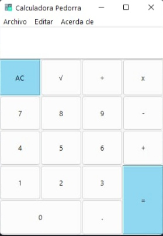

# Calculadora

Calculadora realiza con el módulo tkinter para la generación de interfaces gráficas
utilizando POO básico para la estructura de la calculadora, se usa la versión
de Python 3.10 y se generó un exe con auto-py-to-exe.

1. Clase principal
2. Encampulamiento
3. Herencia

## Funciones básicas.
* Suma
* Resta
* Multiplicación
* División
* Raíz cuadrada

